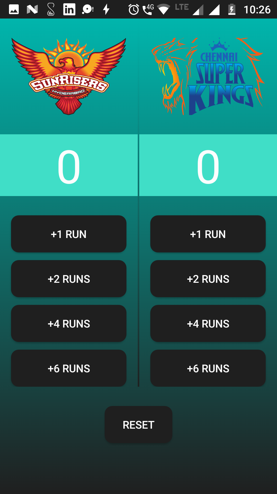
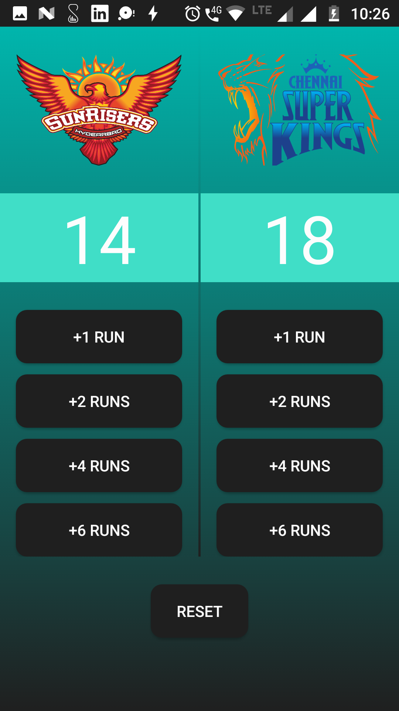
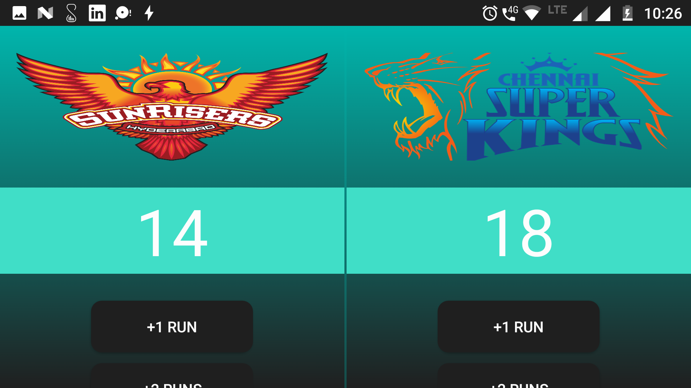

|| [Contact](#contact-me)      ||      [Description](#description-here)  ||    [App Layout](#app-layout)||

# Business-Card
Version 1.0.0

##  **Description about the app:**

IPL 2018 is my 2nd project of Android Basic Nano Degree

**IPL 2018** is the app which calculate the score of two team, by the help of score button and it can be reset to 0 by Reset button

## Build with

- [x] XML
- [x] Java

##   Layout of app

* **Initial layout of the App**
  

* **Layout after pressing score button**
  

* **Data save after rotation**
  

* **Layout of the app, back to initial score after pressing "Reset" button**
  

## **Like my work**,

>**Contact me** on *[Instagram](https://www.instagram.com/imadianand/) [Twitter](https://twitter.com/imadianand) [Facebook](https://www.facebook.com/imadianand) [Google+](https://plus.google.com/u/1/115286953959216936009)*

>**Endorse** my skills on *[Linkedin](https://www.linkedin.com/in/imadianand/)*

